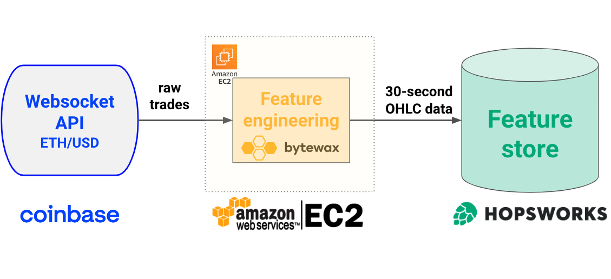

<div align="center">
    <h1>Compute and store real-time features for crypto trading with Python</h1>
    <!-- <i><a href="https://bytewax.io/">Bytewax</a></i> + <i><a href="https://www.hopsworks.ai/">Hopsworks</a></i> = 🚀 -->
</div>

<div align="center">
    <sub>Let's connect 🤗</sub>
    <br />
    <a href="https://twitter.com/paulabartabajo_">Twitter</a> •
    <a href="https://www.linkedin.com/in/pau-labarta-bajo-4432074b/">LinkedIn</a> •
    <a href="https://paulabartabajo.substack.com/">Newsletter</a>
<br />
</div>

<br />

<p align="center">
  
</p>


#### Table of contents
1. [What is this repo about?](#what-is-this-repo-about)
2. [How to run this code](#how-to-run-this-code)
3. [Wannna build real-world ML products?](#wannna-build-real-world-ml-products)


## What is this repo about?
This repository shows how to

* **fetch** real-time trade data (aka *raw data*) from the [Coinbase Websocket API](https://help.coinbase.com/en/cloud/websocket-feeds/exchange)
* **transform** trade data into OHLC data (aka *features*) in real-time using [Bytewax](https://bytewax.io/), and
* **store** these features in a serverless Feature Store like [Hopsworks](https://www.hopsworks.ai/).

This repository is a natural continuation of [this previous project](https://github.com/Paulescu/real-time-ohlc-with-bytewax) where we built a
Streamlit app with real-time feature engineering, but lacked state persistence: after each re-load of the Streamlit app, we lost all features generated up to that point.

In this project we add *state* to our system through a a Feature Store. We use Hopsworks because
- it is serverless, so we do not need to handle infrastructure
- it has a very generous free tier, with up to 25GB of free storage.


## How to run this code

1. Create a Python virtual environment with the project dependencies with
    ```
    $ make init
    ```

2. Set your Hopsworks project name and API key as environment variables by running the following script (to generate these head to hopsworks.ai, create a free account, create a project and generate an API key for free)
    ```
    $ . ./set_environment_variables.sh
    ```

3. To run the feature pipeline locally
    ```
    $ make run
    ```

4. To deploy the feature pipeline on an AWS EC2 instance you first need to have an AWS account and the `aws-cli` tool installed in your local system. Then run the following command to deploy your feature pipeline on an EC2 instance
    ```
    $ make deploy
    ```

5. Feature pipeline logs are send to AWS CloudWatch. Run the following command to grab the URL where you can see the logs.
    ```
    $ make list
    ```

6. To shutdown the feature pipeline on AWS and free resources run
    ```
    $ make delete
    ```

> ℹ️ **Implementation details**
>
>* We use Bytewax as our stream-processing engine and the [`waxctl`](https://bytewax.io/>docs/deployment/waxctl-aws) command line tool to deploy our dataflow to EC2.
>
>* If you want to deploy the pipeline to a Kubernetes cluster, you will need to adjust
> the arguments passed to `waxctl` in the `Makefile`. Check the documentation [here](https://bytewax.io/docs/deployment/waxctl)
> to learn how.

## Wannna build real-world ML products?

Check the [Real-World ML Program](https://realworldmachinelearning.carrd.co/), a hands-on, 3-hour course where you will learn
how to design, build, [deploy](https://taxi-demand-predictor.streamlit.app/), and [monitor](https://taxi-demand-predictor-monitoring.streamlit.app/) complete ML products.